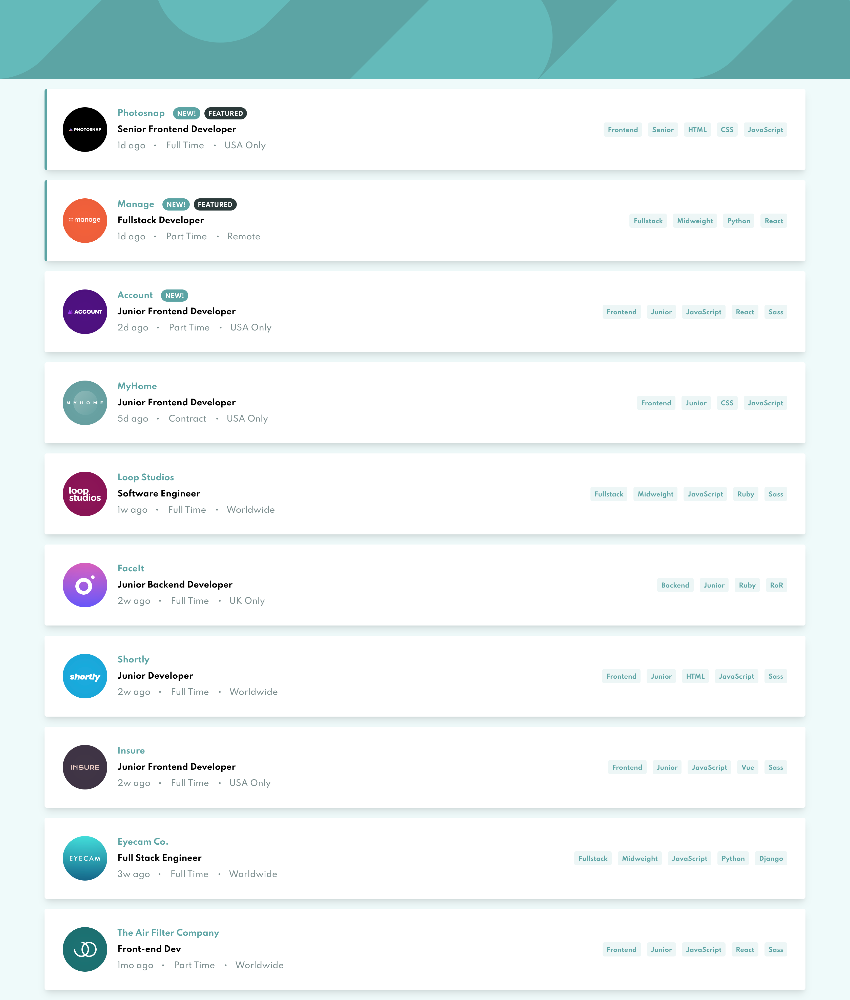

# Frontend Mentor - Job listings with filtering solution

This is a solution to the [Job listings with filtering challenge on Frontend Mentor](https://www.frontendmentor.io/challenges/job-listings-with-filtering-ivstIPCt). Frontend Mentor challenges help you improve your coding skills by building realistic projects. 

## Table of contents

- [Overview](#overview)
  - [The challenge](#the-challenge)
  - [Screenshot](#screenshot)
  - [Links](#links)
- [My process](#my-process)
  - [Built with](#built-with)
  - [What I learned](#what-i-learned)
  - [Continued development](#continued-development)
  - [Useful resources](#useful-resources)
- [Author](#author)

## Overview

### The challenge

Users should be able to:

- View the optimal layout for the site depending on their device's screen size
- See hover states for all interactive elements on the page
- Filter job listings based on the categories

### Screenshot



### Links

- Solution URL: [Github](https://github.com/dsjin/static-job-listing/)
- Live Site URL: [Live Site](https://joblist.dsjin.tk/)

## My process

### Built with

- Semantic HTML5 markup
- CSS custom properties
- SCSS preprocessor
- Flexbox
- Mobile-first workflow
- [Tailwindcss](https://tailwindcss.com/) - CSS Framework
- [React](https://reactjs.org/) - JS library

### What I learned

- First React Website 🎉
- Tailwindcss
    * Reuse Tailwindcss class on some css classes
```scss
.some-custome-css-classes {
    @apply .tailwind-css-class
}
```
- under construction...

### Continued development

- I want to add animations on card
- under construction...

### Useful resources

- under construction...

## Author

- Website - [Thatchakon Jom-ud](https://dsjin.tk)
- Frontend Mentor - [@dsjin](https://www.frontendmentor.io/profile/dsjin)
- Twitter - [@dsjinj](https://www.twitter.com/dsjinj)

